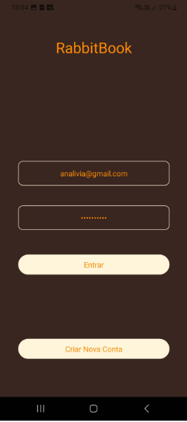
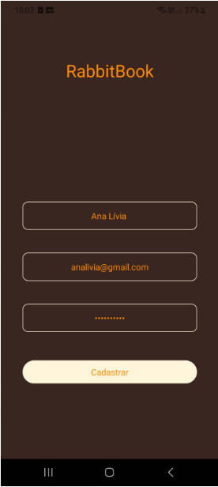
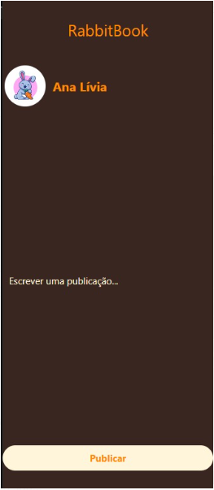
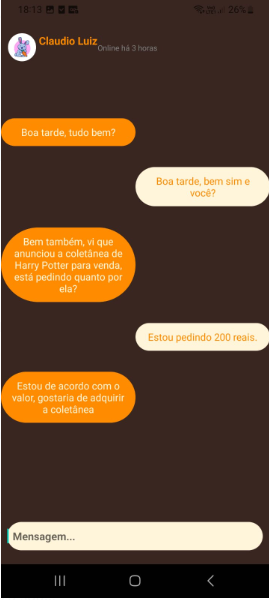
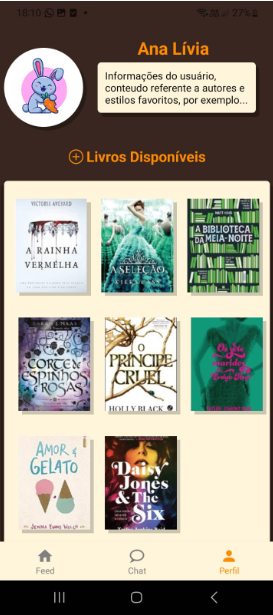

# Registro de Testes de Usabilidade

## Contexto

O presente registro de testes de usabilidade foi realizado na plataforma snack.expo.dev, uma ferramenta online que permite criar e testar aplicativos Expo sem precisar instalar o Expo CLI ou o Expo Go.

## Objetivos

O objetivo deste registro é documentar os resultados dos testes de usabilidade realizados no aplicativo **RabbitBook App**.

## Metodologia

Os testes foram realizados por Gustavo Lemos, que utilizou(aram) os seguintes critérios:

* **Facilidade de uso:** O aplicativo deve ser fácil de entender e usar.
* **Acessibilidade:** O aplicativo deve ser acessível a pessoas com deficiência.
* **Recursos:** O aplicativo deve fornecer recursos suficientes para atender às necessidades dos usuários.
* **Estética:** O aplicativo deve ser agradável de usar.

## Resultados

Os testes revelaram os seguintes resultados:

* **Facilidade de uso:** O aplicativo foi considerado fácil de usar, com um design intuitivo e uma interface clara.
* **Acessibilidade:** O aplicativo foi considerado acessível a pessoas com deficiência, com suporte para recursos como VoiceOver e TalkBack.
* **Recursos:** O aplicativo foi considerado fornecer recursos suficientes para atender às necessidades dos usuários, com uma variedade de funcionalidades que permitem aos usuários realizar as tarefas desejadas.
* **Estética:** O aplicativo foi considerado agradável de usar, com um design moderno e uma interface atraente.

## Conclusão

Os testes de usabilidade revelaram que o aplicativo **Rabbit Book App** é um aplicativo bem projetado e funcional, que atende às necessidades dos usuários leitores de livros que desejam mais conectividade com o mundo dos leitores.

## Recomendações

As seguintes recomendações são feitas para melhorar ainda mais a usabilidade do aplicativo:

* Adicionar a possibilidade de ajustar o tamanho da fonte e o contraste da tela.
* Fornecer mais informações de ajuda e suporte aos usuários.

## Anexos e evidências de teste

* Login

* Cadastro

* Feed de publicações

* Criação de Post

* Chats e grupos

* Chat 

* Criação de grupos

* Perfil

* Comentários
- Atendemos tudo que estava planejado no figma melhorando muito pontos no frontend
- Algumas integrações planejadas via figma devem ser replanejadas
- Talvez algumas integrações com a api aberta Biblioteca Google sejam interessantes
