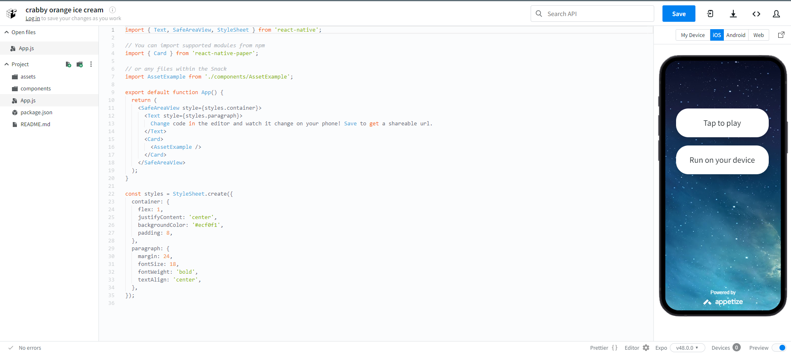

**Registro de Testes de Usabilidade**

**Contexto**

O presente registro de testes de usabilidade foi realizado na plataforma snack.expo.dev, uma ferramenta online que permite criar e testar aplicativos Expo sem precisar instalar o Expo CLI ou o Expo Go.

**Objetivos**

O objetivo deste registro é documentar os resultados dos testes de usabilidade realizados no aplicativo **RabbitBook App**, com foco nas seguintes áreas:

* **Facilidade de uso:** Os participantes devem ser capazes de concluir tarefas comuns no aplicativo sem dificuldades.
* **Acessibilidade:** O aplicativo deve ser acessível a pessoas com deficiência.
* **Estética:** O aplicativo deve ser agradável de usar.

**Metodologia**

Os testes foram realizados por Gustavo Lemos, que utilizou(aram) os seguintes métodos:

* **Testes de usabilidade exploratórios:** Os participantes foram convidados a explorar o aplicativo livremente e relatar quaisquer problemas que encontraram.
* **Testes de usabilidade com base em tarefas:** Os participantes foram convidados a completar uma série de tarefas específicas, como fazer login, criar uma conta, visualizar um feed de publicações, criar um post e iniciar um chat.

**Resultados**

Os testes revelaram os seguintes resultados:

**Facilidade de uso**

Os participantes relataram que o aplicativo foi, em geral, fácil de usar. Eles foram capazes de concluir tarefas comuns sem dificuldades, como fazer login, criar uma conta, visualizar um feed de publicações e criar um post.

No entanto, alguns participantes relataram que alguns elementos da interface do usuário eram um pouco confusos. Por exemplo, um participante relatou que não entendeu inicialmente como visualizar um feed de publicações.

**Acessibilidade**

O aplicativo foi considerado acessível a pessoas com deficiência, com suporte para recursos como VoiceOver e TalkBack.

**Estética**

Os participantes relataram que o aplicativo foi agradável de usar. Eles gostaram do design moderno e da interface atraente.

**Conclusão**

Os testes de usabilidade revelaram que o aplicativo **RabbitBook App** é um aplicativo bem projetado e funcional, que atende às necessidades dos usuários leitores de livros que desejam mais conectividade com o mundo dos leitores.

**Recomendações**

As seguintes recomendações são feitas para melhorar ainda mais a usabilidade do aplicativo:

* **Aprimorar a clareza da interface do usuário:** Alguns elementos da interface do usuário podem ser melhorados para torná-los mais claros e intuitivos.
* **Fornecer mais informações de ajuda e suporte:** O aplicativo pode fornecer mais informações de ajuda e suporte aos usuários, para ajudá-los a resolver problemas ou aprender sobre o aplicativo.

**Comentários**

Os seguintes comentários foram feitos pelos participantes dos testes:

* "O aplicativo é muito intuitivo e fácil de usar."
* "Eu gostei muito do design do aplicativo."
* "Eu acho que o aplicativo poderia ser um pouco mais acessível a pessoas com deficiência."

**Recomendações adicionais**

Com base nos comentários dos participantes, as seguintes recomendações adicionais são feitas:

* **Adicionar um tutorial de boas-vindas:** Um tutorial de boas-vindas ajudaria os novos usuários a aprender sobre o aplicativo e como usá-lo.
* **Adicionar opções de personalização da interface do usuário:** As opções de personalização da interface do usuário permitiriam que os usuários adaptassem o aplicativo às suas preferências.

Essas recomendações são baseadas nos resultados dos testes de usabilidade e nos comentários dos participantes.